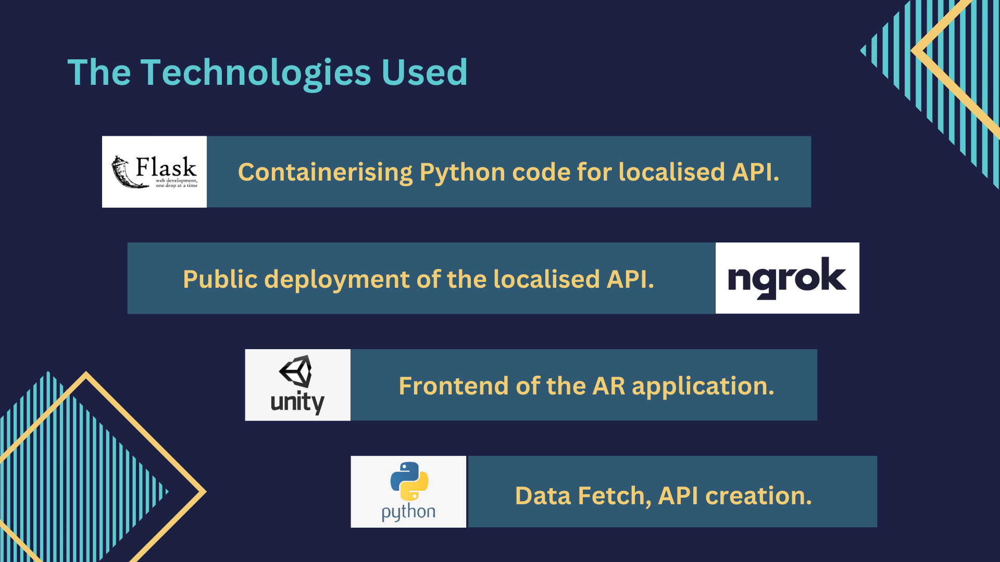

# Diversion2k23

## Project: Fandom

### Team: Radiants (Abhirup Mazumder, Debjyoti Ghosh, Rohan Bhattacharjee)

## What is Fandom?

Oh you love Manchester United and as a devoted fan you want to feel the best immersive fan experience ever?

We heard you guys. Fandom is an immersive AR experience for club football fans (or maybe some other sport as well) which celebrates the crazy love and support of the fans.

Hold your breath as you dive into the augmented world of the Red Devils or maybe the Gunners or maybe some other club that you heart!

## The Technology that goes into it:

## File Description

-`apigen.py`: This is the master python file which encloses the `fixture()`, `news()`, `standings()`and `predictions()` functions. The data fetched through these functions are channelised into a local API using Flask. Further, the local API is deployed publically via ngrok.

    fixture() - gets a json response for the fixtures of the team.
    news() - gets a json response for the news related to the team.
    standings() - gets a json response of the league standings for the team.
    predictions() - gets a json response of the predicted score of the upcoming match.

-`goal.py`: This is the part of python file which is revolving around the idea of using a predictive model with the main aim of providing a prediction of the upcoming match and will also provide an insight about how many goals that might be conceived in a single match.

Unity Project Folder - [Unity Project Folder](https://drive.google.com/file/d/1_CzkM9CT_KiQn9-7L1cSVMlqkZx4Zp0q/view?usp=share_link)

## Steps to run

`python apigen.py`

`ngrok http [port]` (Note port number should be same as the locally hosted Flask, typically 5000))

Click on the forwarding web address to view the deployed site.

Finally run the Diversion2k23.apk and scan the logo to get started.

## Future Scope

-Expand fan base to multiple clubs and franchises.

-Gesture Detection and Interaction via Scripting.

-Use of a single premium API (like API-Football) to fetch data about the standings, fixtures and news of your favourite team.

-Introduction to interactive marketplace exclusive to the fans.

-Merchandise try-on via AR
